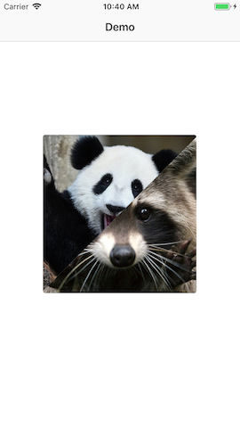
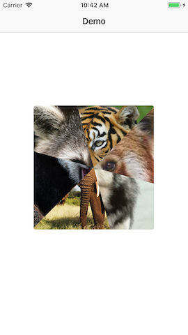
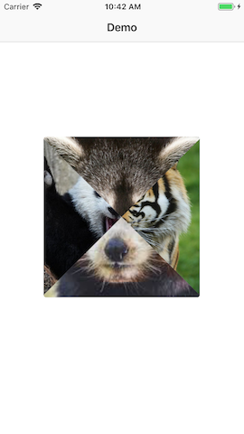
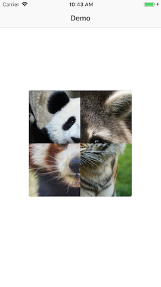

#### [HIRE US](http://vrgsoft.net/)


# CombinedView

Meet a simple library for iOS application to combine different images in one UIView like Apple Music album covers. You can use as many images as you want.


 


### Usage

Add a `UIView` instance in your .storyboard or .xib, set a `CombinedView` class, connect an `IBOutlet` and call `combine(images: [UIImage?]` func with an array of images.

```swift
import CombinedView

class ViewController: UIViewController {

	@IBOutlet weak var combinedView: CombinedView!

	override func viewDidLoad() {
		super.viewDidLoad()

		combinedView.combine(images: [UIImage(named: "panda"), UIImage(named: "racoon"), UIImage(named: "tiger"), UIImage(named: "animal")])
	}
}
```


Setup `CombinedView` if needed

```swift
override func viewDidLoad() {
	super.viewDidLoad()
        
	combinedView.combine(images: [UIImage(named: "panda"), UIImage(named: "racoon"), UIImage(named: "tiger"), UIImage(named: "animal")])
	combinedView.cornerRadius = 4
	combinedView.startAngle = 0
	combinedView.contentMode = .scaleAspectFill
}
```



# Customization
| Parameter  | Description |
| ------------- | ------------- |
| cornerRadius  | Sets current view corner radius  |
| startAngle   | Sets start angle for images rotation  |


## Compatibility
  
  * IOS 11+
  
## Changelog

### Version: 1.0

  * Initial Build

## Contributors

* Contributions are always welcome
* If you want a feature and can code, feel free to fork and add the change yourself and make a pull request
